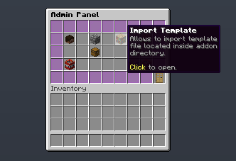
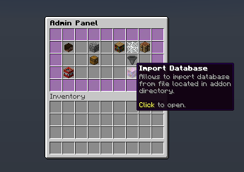
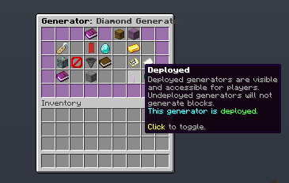

# MagicCobblestoneGenerator

**MagicCobblestoneGenerator** turns the plain and boring cobblestone generators to an awesome and reliable source of configurable blocks!

Created and maintained by [BONNe](https://github.com/BONNe).

{{ addon_description("MagicCobblestoneGenerator") }}

## Installation
Copy the JAR file into the addons folder of BentoBox and restart the server. You will find a new folder created and a config file.


### Config.yml walkthrough
The latest config file is [here](https://github.com/BentoBoxWorld/MagicCobblestoneGenerator/blob/develop/src/main/resources/config.yml)


## Placeholders
Please read the main [Placeholders page](/en/latest/BentoBox/Placeholders).

| Placeholder | Description | Version |
|-------------------------------------------------------|--------------------------------------------------------------------------------|-----------|
| `%[gamemode]_magiccobblestonegenerator_active_generator_count` | Returns number of currently active generator tiers | 2.1.0 |
| `%[gamemode]_magiccobblestonegenerator_max_active_generator_count` | Returns number of maximal amount of active generator tiers | 2.1.0 |
| `%[gamemode]_magiccobblestonegenerator_active_generator_names` | Returns text that contains all active generator names separated with `,` | 2.1.0 |
| `%[gamemode]_magiccobblestonegenerator_unlocked_generator_names` | Returns text that contains all unlocked generator names separated with `,` | 2.1.0 |
| `%[gamemode]_magiccobblestonegenerator_purchased_generator_names` | Returns text that contains all purchased generator names separated with `,` | 2.1.0 |

## Permissions

- `[gamemode].stone-generator` - Let the player use the '/[player_command] generator' command and its subcommands.
- `[gamemode].admin.stone-generator` - Let the player use the '/[admin_command] generator' command and its subcommands.
- `[gamemode].admin.stone-generator.why` - Let the player use a debug command '/[admin_command] why generator <player>'.
- `[gamemode].admin.stone-generator.database` - Let the player use the '/[admin_command] generator database' command and its subcommands.
- `[gamemode].stone-generator.active-generators.[NUMBER]` - permission for island owner that allows increasing active generator number.
- `[gamemode].stone-generator.max-range.[NUMBER]` - permission for island owner that allows increasing range in which generator will work. Be aware, it must be enabled in the config.
- `[gamemode].stone-generator.bundle.[bundle_id]` - permission for island owner that allows to set specific generator bundle that will work on his island.

## FAQ
#####  Can you add a feature X?

Please add it to the list [here](https://github.com/BentoBoxWorld/MagicCobblestoneGenerator/issues).

##### I can code Java and I would like to be a maintainer of this addon!

Great! Start by forking the repo and then submit some PR's. If your PR's start to get accepted and your code is good we might ask you to become the maintainer. We are a meritocracy!

##### Can tiers be determined by permission?

No, not yet.

##### How can I add a new generator tier?

Currently, addon supports 3 ways how to add a new generator:
a) By using ingame GUI that is available via `/[admin] generator` command.
b) By adding generator to a template file. 
c) By adding generator to the exported database file.

##### I added generator to the template/database file, but it does not shows up in game.

For easier configuration with multiple gamemodes, generators are stored in the internal database. After editing template or database file, you need to import them into that memory. You can do it via Admin GUI by clicking on `Import Template` or `Import Database` buttons.

{: loading=lazy }
{: loading=lazy }

##### I have a generator that shows up in Admin GUI, but players do not see it. 

Most likely it is because of "deployment" status. To avoid with issues when players starts to activate generators while an admin is adding them, generators are undeployed and noone can use them. You can activate them by editing generator via Admin GUI and clicking on lever in Edit Generator GUI.
{: loading=lazy }

##### What is treasures?

Treasures are things that are dropped uppon block generation from generator.

##### What is bundles?

Bundles is a feature that allows customizing experience for each island even more. If bundle is assigned to an island, then players on that island will be able to use only generators from that bundle. 

##### Can I disable showing required permissions?

Yes, addon provides a lot of customization options for displaying each generator. It is located in locales file:
```
      # Generator lore message generator. All elements in generator lore is generated
      # based on section below.
      generator:
        # Main lore element content. If you do not want to display treasures at all,
        # just remove them from [treasures] section.
        # [description] comes from each generator tier.
        # Lore does not supports colour codes. Each object separate supports.
        lore: |-
          [description]
          [blocks]
          [treasures]
          [type]
          [requirements]
          [status]
        # Generates [blocks] section
        blocks:
          # First line in blocks section. Empty line will not be displayed.
          title: "&7&l Blocks:"
          # Each block and its value under title. Cannot be empty.
          # Supports [number], [#.#], [#.##], [#.###], [#.####], [#.#####]
          value: "&8 [material] - [#.##]%"
        # Generates [treasures] section
        treasures:
          # First line in blocks section. Empty line will not be displayed.
          title: "&7&l Treasures:"
          # Each treasure and its value under title. Cannot be empty.
          # Supports [number], [#.#], [#.##], [#.###], [#.####], [#.#####]
          value: "&8 [material] - [#.####]%"
        # Generates [requirements] section
        requirements:
          # Allows to change order and content of requirements message.
          description: |-
            [biomes]
            [level]
            [missing-permissions]
          # Generates [level] message.
          level: "&c&l Required Level: &r&c [number]"
          # Generates [missing-permission] message title.
          permission-title: "&c&l Missing Permissions:"
          # Generates [missing-permission] message values.
          permission: "&c  -[permission]"
          # Generates [biomes] message title.
          biome-title: "&7&l Operates in:"
          # Generates [biomes] message values.
          biome: "&8 [biome]"
          # Generates [biomes] message for All Biomes.
          any: "&7&l Operates in &e&o all &r&7&l biomes"
        # Generates [status] section
        status:
          # Message that is showed for Locked generators.
          locked: "&c Locked!"
          # Message that is showed for generators that is not deployed.
          undeployed: "&c Not Deployed!"
          # Message that is showed for Active generators.
          active: "&2 Active"
          # Message that is showed for generators that required purchasing.
          purchase-cost: "&e Purchase Cost: $[number]"
          # Message that is showed for generators that has activation cost.
          activation-cost: "&e Activation Cost: $[number]"
        # Generates [type] section
        type:
          title: "&7&l Supports:"
          cobblestone: "&8 Cobblestone Generators"
          stone: "&8 Stone Generators"
          basalt: "&8 Basalt Generators"
          any: "&7&l Supports &e&o all &r&7&l generators"
```

## Translations

{{ translations(2972, ["de", "es", "lv"]) }}
